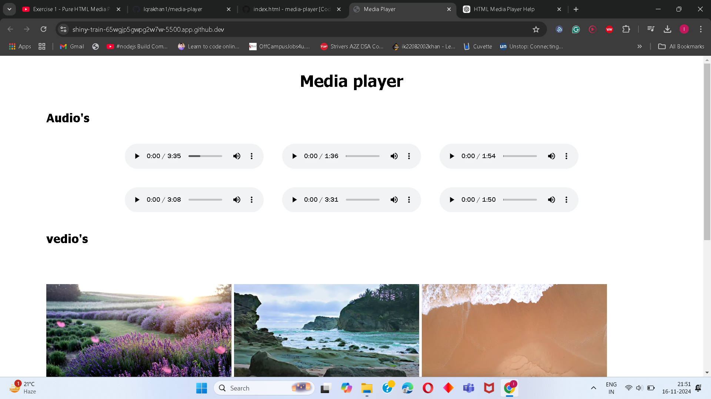

# Pure HTML Media Player

This project is a simple media player built using pure HTML. It allows users to play six audio files and view six video files, all displayed in a clean and responsive layout. The project uses HTML5's `<audio>` and `<video>` elements to provide playback functionality.

## Features
- Play six audio files with individual controls.
- Display and play six video files.
- Minimal and clean user interface.
- No external libraries or frameworks required.

## Technologies Used
- **HTML5**: For structuring the webpage and embedding media elements.
- **CSS (optional)**: For basic styling (if you added any custom styles).

## Screenshot
Here is a preview of the Media Player:


 or 

 - live link :- https://github.com/Iqrakhan1/media-player/

## How to Use
1. Clone or download this repository to your local machine.
2. Open `index.html` in any modern web browser (e.g., Chrome, Firefox).
3. Use the playback controls to listen to audio or watch video files.

## Requirements
- A modern web browser with support for HTML5 audio and video elements.

## Media Files
The project includes six audio files (`.mp3`) and six video files (`.mp4`) located in the `media` folder. These files are sourced from free resources available online.

## How to Add More Media
1. Add your audio and video files to the `media` folder.
2. Update the `index.html` file to include the new files, using the following format:
   ```html
   <audio controls>
       <source src="media/your-audio-file.mp3" type="audio/mpeg">
   </audio>
   <video controls>
       <source src="media/your-video-file.mp4" type="video/mp4">
   </video>
